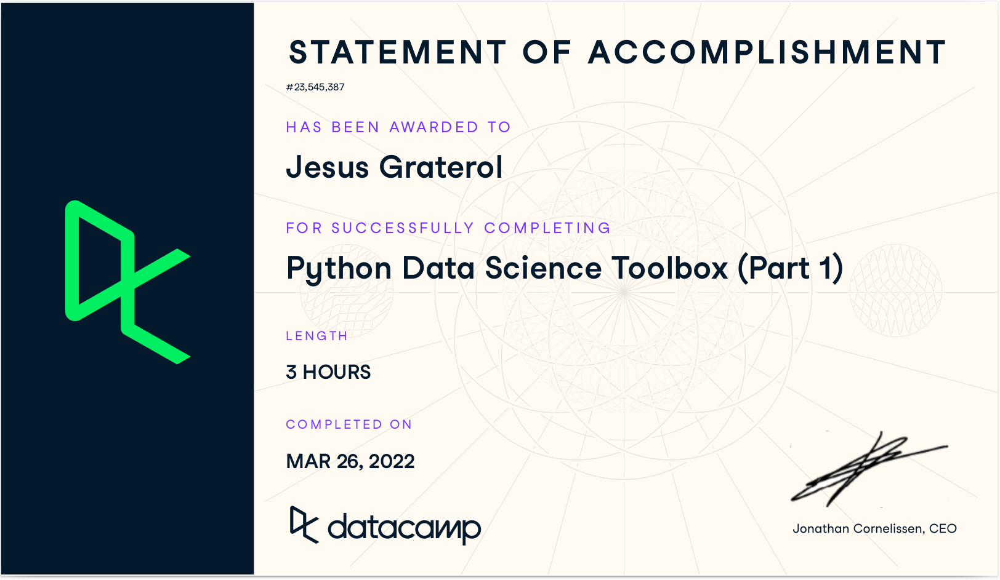

# Certifications

This repository contains all of the certificates that have been issued to [Jesus Graterol](https://jesusgraterol.dev/) by:

* [The Linux Foundation (Coursera)](https://www.coursera.org/) | [View certificates](#the-linux-foundation)
* [Meta (Coursera)](https://www.coursera.org/) | [View certificates](#meta)
* [DataCamp](https://www.datacamp.com/) | [View certificates](#datacamp)
* [Kaggle](https://www.kaggle.com/) | [View certificates](#kaggle)

The certificate files can be found in the [`assets`](https://github.com/jesusgraterol/certificates/tree/main/assets) directory.

 

## The Linux Foundation

The Linux Foundation is a non-profit organization established in 2000 to support Linux development and open-source software projects.

The certificate was issued by [The Linux Foundation](https://www.linuxfoundation.org/) through [Coursera's Platform](https://www.coursera.org/).

### Open Source Software Development, Linux and Git *~2 months*

Get the skills and knowledge you need to develop open source software using Linux, Git, and ... [View Course](https://www.coursera.org/account/accomplishments/specialization/NX9P2RH9S2SH)

   

## Meta

Meta is an American multinational technology conglomerate based in Menlo Park, California. The company owns and operates Facebook, Instagram, Threads, and WhatsApp, among other products and services.

These certificates was issued by [Meta](https://www.meta.com/) through [Coursera's Platform](https://www.coursera.org/).

### Front-End Developer *~7 months*

Gain the technical skills required to become a qualified front-end developer by learning in-demand programming skills and ... ... [View Course](https://www.coursera.org/account/accomplishments/professional-cert/ZBVQ5467DY4X)

### Back-End Developer *~8 months*

Gain the technical skills required to become a qualified back-end developer by learning in-demand programming skills and ... [View Course](https://www.coursera.org/account/accomplishments/professional-cert/LPZN5TBS3CM8)

### Database Engineer *~6 months*

You’ll learn the key skills required to create, manage and manipulate databases, as well as ... [View Course](https://www.coursera.org/account/accomplishments/professional-cert/J3EWLFZMRFP8)

   

## DataCamp

DataCamp is an online learning platform that focuses on teaching students the comprehensive skills they need to become successful data scientists. Industry experts teach these courses. The courses range in variety and offer curricula in topics like programming, web development, software engineering, and data cleaning. These courses are comprehensive and affordable alternatives to traditional four-year degrees.

These certificates were issued by [DataCamp](https://www.datacamp.com/) through their online platform and the courses took approximately **87 hours** to complete.

**Profile:** [jesusgraterol](https://www.datacamp.com/portfolio/jesusgraterol)

### Introduction to Python *~4 hours*

Python has grown to become the market leader in programming languages and the language of choice for data analysts and data scientists. Demand ... [View Course](https://www.datacamp.com/completed/statement-of-accomplishment/course/e32f42d091b8541e6799919ef1acb8b431ba6db1)

### Intermediate Python *~4 hours*

Learn to visualize real data with Matplotlib’s functions and get acquainted with data structures such as the dictionary and pandas DataFrame. This four-hour ... [View Course](https://www.datacamp.com/completed/statement-of-accomplishment/course/a204f86cfa55b9e9531151e1c97728ad9b763d4b)

### Writing Efficient Python Code *~4 hours*

As a Data Scientist, the majority of your time should be spent gleaning actionable insights from data -- not waiting for your code to finish running. Writing efficient code ... [View Course](https://www.datacamp.com/completed/statement-of-accomplishment/course/4cd17b159eaf8d326df01753590e3f56db937e5f)

### Writing Functions in Python *~4 hours*

You've done your analysis, built your report, and trained a model. What's next? Well, if you want to deploy your model into production... [View Course](https://www.datacamp.com/completed/statement-of-accomplishment/course/920e6860f5e466c637a2e069c9d04669e4d87bc0)

### Object-Oriented Programming in Python *~4 hours*

Object-oriented programming (OOP) is a widely used programming paradigm that reduces development times—making it easier to read, reuse, and maintain your code. OOP shifts ... [View Course](https://www.datacamp.com/completed/statement-of-accomplishment/course/c900bea19c00a8e273638335ea4c0300f1d56311)

### Python Fundamentals *~15 hours*

[View Course](https://www.datacamp.com/completed/statement-of-accomplishment/track/d3bd3cee7bbf782ebafca027d757d92823695e9e)

### Introduction to Python for Finance *~4 hours*

The financial industry uses Python extensively for quantitative analysis, ranging from understanding trading dynamics to risk management systems. [View Course](https://www.datacamp.com/completed/statement-of-accomplishment/course/aa7d9ac1a32cee9dc6fb2418384254b499c0916e)

### Intermediate Python for Finance *~4 hours*

Learning Python can automate financial tasks such as calculating risk, mapping market health, and visualizing a stock's price trends, saving you time and money... [View Course](https://www.datacamp.com/completed/statement-of-accomplishment/course/345aaf5c5ae122f19367a0bb2d09b04cffa5c10d)

### Software Engineering Principles in Python *~4 hours*

Data scientists can experience huge benefits by learning concepts from the field of software engineering, allowing them to more easily reutilize their code and ... [View Course](https://www.datacamp.com/completed/statement-of-accomplishment/course/98d14ef6457fcf293ed33da74a4fd5131aab9735)

### Data Types for Data Science in Python *~4 hours*

Herein, you'll consolidate and practice your knowledge of lists, dictionaries, tuples, sets, and date times. You'll see their relevance in working with lots of real data and ... [View Course](https://www.datacamp.com/completed/statement-of-accomplishment/course/3b9f77f4579cc8376bc24ca5a9f7043ef99f9bc9)

### Python Data Science Toolbox (Part 1) *~3 hours*

It's time to push forward and develop your Python chops even further. There are tons of fantastic functions in Python and its library ecosystem. However, as a data scientist, you'll ... [View Course](https://www.datacamp.com/completed/statement-of-accomplishment/course/cfec6a9bcdf20e80cdff64c439467bd7521991cf)

### Python Data Science Toolbox (Part 2) *~4 hours*

In this second Python Data Science Toolbox course, you'll continue to build your Python data science skills. First, you'll learn about iterators, objects ... [View Course](https://www.datacamp.com/completed/statement-of-accomplishment/course/cfec6a9bcdf20e80cdff64c439467bd7521991cf)

### Data Manipulation with pandas *~4 hours*

With this course, you’ll learn why pandas is the world's most popular Python library, used for everything from data manipulation to... [View Course](https://www.datacamp.com/completed/statement-of-accomplishment/course/697cea7356018cc64fbd3681a77b2347bca66176)

### Introduction to NumPy *~4 hours*

Gain an introduction to Numpy and understand why this Python library is essential to all Python data scientists and analysts. Most importantly, learn more about Numpy arrays and ... [View Course](https://www.datacamp.com/completed/statement-of-accomplishment/course/3405f3f27e42b32360ff080f3eff2120ecd5bdf4)

### Introduction to TensorFlow in Python *~4 hours*

Not long ago, cutting-edge computer vision algorithms couldn’t differentiate between images of cats and dogs. Today, a skilled data scientist equipped with ... [View Course](https://www.datacamp.com/completed/statement-of-accomplishment/course/0c565806e023cabc9e9fcef286d3e3a1043c8821)

### Introduction to Deep Learning with Keras *~4 hours*

Deep learning is here to stay! It's the go-to technique to solve complex problems that arise with unstructured data and an incredible tool for innovation. Keras is one of ... [View Course](https://www.datacamp.com/completed/statement-of-accomplishment/course/9f6c797654d71618217f73d92b55eba99d604a09)

### Advanced Deep Learning with Keras *~4 hours*

This course shows you how to solve a variety of problems using the versatile Keras functional API. You will start with simple, multi-layer dense networks (also known as ... [View Course](https://www.datacamp.com/completed/statement-of-accomplishment/course/faed11866898523564ae8892f92840429ea5ff3d)

### Intermediate SQL Queries *~4 hours*

The role of a data scientist is to turn raw data into actionable insights. Much of the world's raw data—from electronic medical records to customer transaction histories—lives ... [View Course](https://www.datacamp.com/completed/statement-of-accomplishment/course/a2dfff89a75ce7b4ee67f0e1145c25499b18f918)

### SQL for Joining Data *~5 hours*

Now that you've learned the basics of SQL, it's time to supercharge your queries using joins and relational set theory. In this course, you'll learn all about the power of ... [View Course](https://www.datacamp.com/completed/statement-of-accomplishment/course/963a28d531281c80d3e5e3f08f8c23c7c8dc8750)

   

## Kaggle

Kaggle is a data science competition platform and online community of data scientists and machine learning practitioners under Google LLC. Kaggle enables users to find and publish datasets, explore and build models in a web-based data science environment, work with other data scientists and machine learning engineers, and enter competitions to solve data science challenges.

These certificates were issued by [Kaggle](https://www.kaggle.com/) through the [Kaggle Learn Program](https://www.kaggle.com/learn) and the courses took approximately **29 hours** to complete.

**Profile:** [jesusgraterol](https://www.kaggle.com/jesusgraterol)

### Intro to Programming *~5 hours*

Get started with Python, if you have no coding experience. [View Course](https://www.kaggle.com/learn/intro-to-programming)

### Python *~5 hours*

Learn the most important language for data science. [View Course](https://www.kaggle.com/learn/python)

### Pandas *~4 hours*

Solve short hands-on challenges to perfect your data manipulation skills. [View Course](https://www.kaggle.com/learn/pandas)

### Data Visualization *~4 hours*

Make great data visualizations. A great way to see the power of coding! [View Course](https://www.kaggle.com/learn/data-visualization)

### Intro to Machine Learning *~3 hours*

Learn the core ideas in machine learning, and build your first models. [View Course](https://www.kaggle.com/learn/intro-to-machine-learning)

### Intermediate Machine Learning *~4 hours*

Handle missing values, non-numeric values, data leakage, and more. [View Course](https://www.kaggle.com/learn/intermediate-machine-learning)

### Intro to Deep Learning *~4 hours*

Use TensorFlow and Keras to build and train neural networks for structured data. [View Course](https://www.kaggle.com/learn/intro-to-deep-learning)

